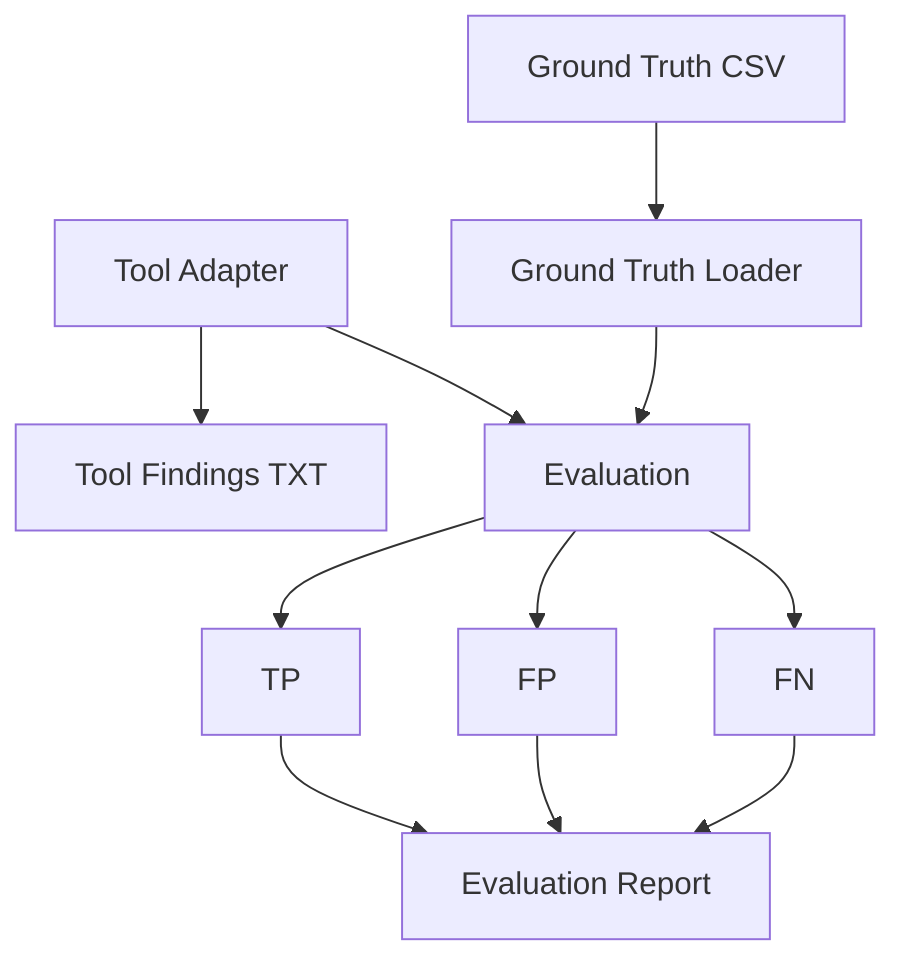

# Project-Centric Vulnerability Evaluation  
**Methodology · Architecture · Implementation State (Single Source of Truth)**

This document is the authoritative and persistent description of the
project-centric vulnerability evaluation framework.

It combines in one single file:
- evaluation methodology,
- matching semantics,
- tool interpretation rules,
- produced artifacts and naming conventions,
- full project structure,
- and an architectural overview graphic.

No external context is required to understand or continue work on this project.

---

## 1. Evaluation Objective

The goal of the evaluation is to assess how accurately a vulnerability detection tool
reports known vulnerabilities for a fixed and fully specified project state.

A project state is defined by:
- a concrete set of software components,
- with exact versions,
- across multiple ecosystems.

The evaluation is therefore component–version centric and explicitly
not vulnerability-centric in the abstract.

Tools are expected to report vulnerabilities only for the components and versions
that are actually used in the project.

Reporting vulnerabilities for other versions or components is considered
over-approximation and is penalized.

---

## 2. Ground Truth Definition

The ground truth dataset consists of tuples (e, c, v, I):

- e: ecosystem (maven, npm, pypi, nuget, golang)
- c: normalized component identifier
- v: exact component version
- I: non-empty set of vulnerability identifiers (CVE, GHSA, OSV)

Ground Truth Invariant:

All vulnerabilities known to the OSV reference database at dataset creation time
are included. The ground truth is complete, time-fixed, and immutable.

---

## 3. Tool Output Model

A tool produces findings (e, c, v', I') where v' is an exact version or version range.

---

## 4. Matching Semantics

Identifier Matching:
I ∩ I' ≠ ∅

Version Matching:
- Exact: v' = v
- Range: v ∈ range(v')

No fuzzy matching is allowed.

---

## 5. Classification

- TP: tool finding matches a ground truth entry
- FN: no tool finding matches a ground truth entry
- FP: tool finding matches no ground truth entry

---

## 6. False Negative Subcategories

- FN_exact
- FN_range
- FN_true

Precedence:
FN_exact → FN_range → FN_true

---

## 7. Metrics

Recall = TP / (TP + FN)  
Overlap = TP / (TP + FP)

---

## 8. Tool-Specific Interpretation

### OSV

OSV is a reference/control source. Findings missing from ground truth indicate
post-dataset disclosures (ground-truth drift).

### Evaltech

Evaltech is a meta-adapter applying FP heuristics on Dependency-Track findings.
It does not introduce new detections.

---

## 9. Produced Evaluation Artifacts

All artifacts are prefixed with the ground truth dataset name.

- <ground_truth>_<tool>_<run_id>_tool_findings.txt
- <ground_truth>_<tool>_<run_id>_evaluation_report.txt
- <ground_truth>_<tool>_<run_id>_statistics.txt

---

## 10. Architecture Overview



---

## 11. Project Structure

## 11. Project Structure

```text


evaluation/
├── adapters/
├── core/
├── analysis/
├── reporting/
├── ground_truth.py
├── evaluate.py

evaluation/
├── adapters/
│   ├── dtrack.py        # Dependency-Track adapter
│   ├── snyk.py          # Snyk SBOM-based adapter
│   ├── osv.py           # OSV reference / control adapter
│   ├── oss_index.py     # Sonatype OSS Index adapter (real API)
│   ├── evaltech.py      # Evaltech FP-heuristic meta-adapter
│
├── core/
│   ├── model.py         # Finding data model
│   ├── normalization.py # Central normalization logic
│   ├── ecosystems.py   # Ecosystem definitions
│
├── analysis/
│   └── tool_findings.py # Post-evaluation diagnostics
│
├── reporting/
│   ├── evaluation_report.py # Main evaluation report
│   ├── tool_findings_txt.py # Normalized tool findings dump
│
├── ground_truth.py      # Ground truth CSV loader (normalized)
├── evaluate.py          # CLI entry point and orchestration


---

## 12. Architectural Invariant

Evaluation decides.  
Analysis explains.  
Reporting presents.

---

## 13. Reproducibility Guarantee

Given identical ground truth, tool configuration, and tool version,
the framework produces deterministic, comparable results.

---
